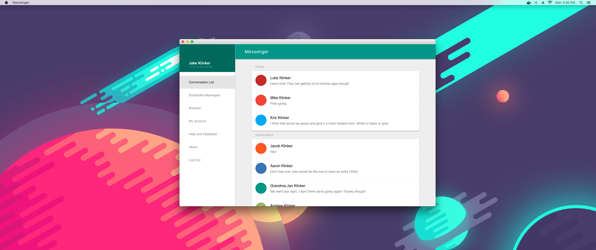

# Messenger

A simple chrome app and extension that wraps the Pulse SMS webpage. It also works on Firefox.

## Usage

1. Open up chrome and go to the [extensions](chrome://extensions/) page.
2. Select the `Load Unpacked` option and open the `browser-extension` or `chrome-app`.

## Release Instructions

### Chrome App/Extension

1. Compress the app directory to a `.zip` file.
2. Upload to the [Chrome Web Store Developer Console](https://chrome.google.com/webstore/developer/dashboard)

### Firefox Extension

1. Open up chrome and go to the [extensions](chrome://extensions/) page.
2. Pack the extension with the folder and the `extension.pem` file
3. Upload the extension to Mozilla, on your own developer portal. Example: https://addons.mozilla.org/en-US/developers/addon/klinkerapps-messenger/versions/1972213

## Contributing

Please fork this repository and contribute back using [pull requests](https://github.com/klinker-apps/messenger-chrome/pulls). Features can be requested using issues on our Pulse platform issue tracker, rather than creating issues directly on this repo: https://github.com/klinker-apps/messenger-issues.

## License

    Copyright 2018 Luke Klinker

    Licensed under the Apache License, Version 2.0 (the "License");
    you may not use this file except in compliance with the License.
    You may obtain a copy of the License at

       http://www.apache.org/licenses/LICENSE-2.0

    Unless required by applicable law or agreed to in writing, software
    distributed under the License is distributed on an "AS IS" BASIS,
    WITHOUT WARRANTIES OR CONDITIONS OF ANY KIND, either express or implied.
    See the License for the specific language governing permissions and
    limitations under the License.
